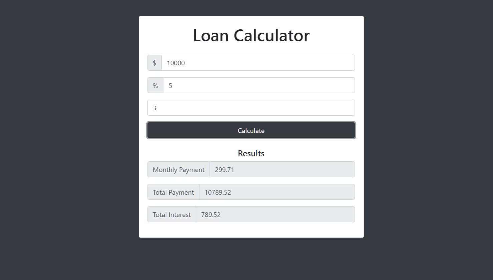

This is Loan Calculator app built with Vanilla_JavaScript. UI of this app is done with Bootstrap. Gif has been used to show the spinner for better user experience. setTimeout function is used for displaying error and spinner.

The purpose of this app was to learn the manipulation of DOM using the Vanilla_Javascript. How to use setTimeout to display certain message to user for specific time of period.

To run the project, Download or clone it on your machine and open index.html on your browser.

